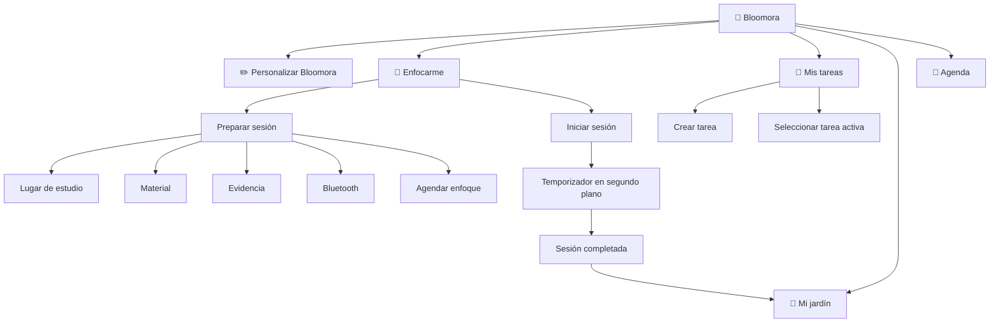
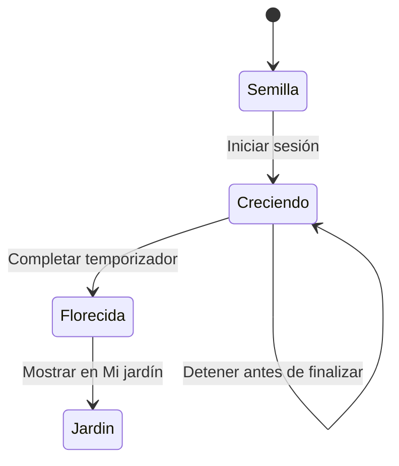
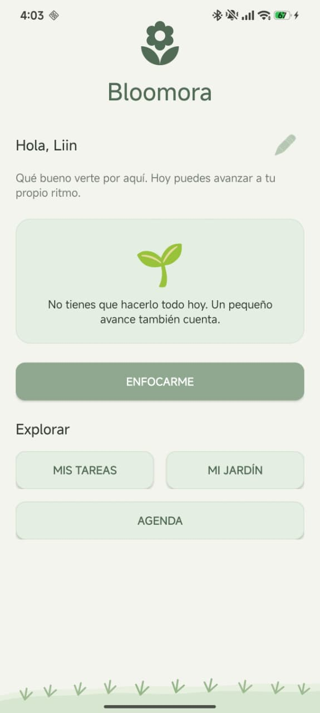
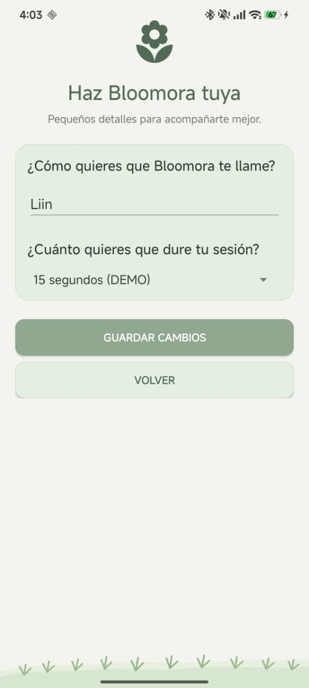
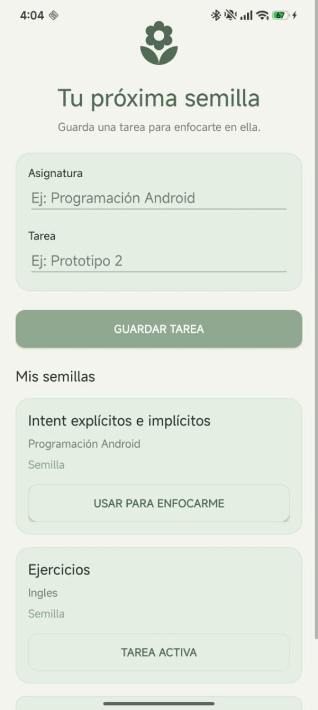
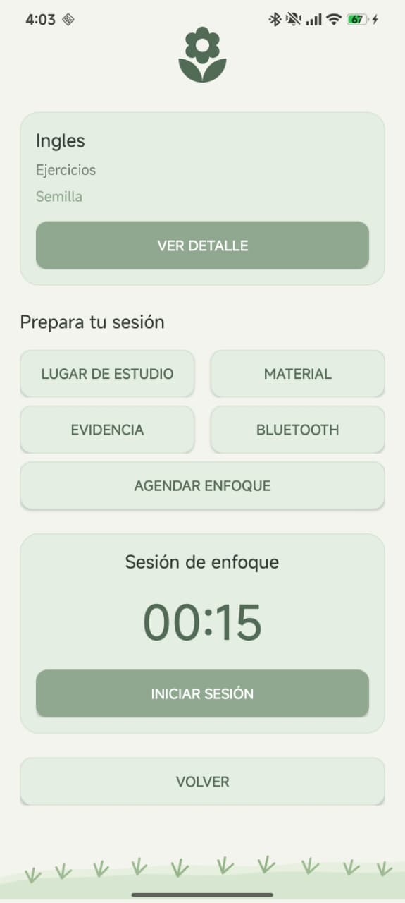
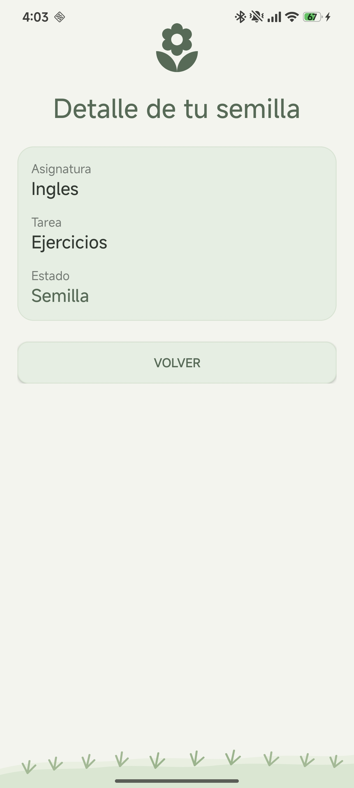
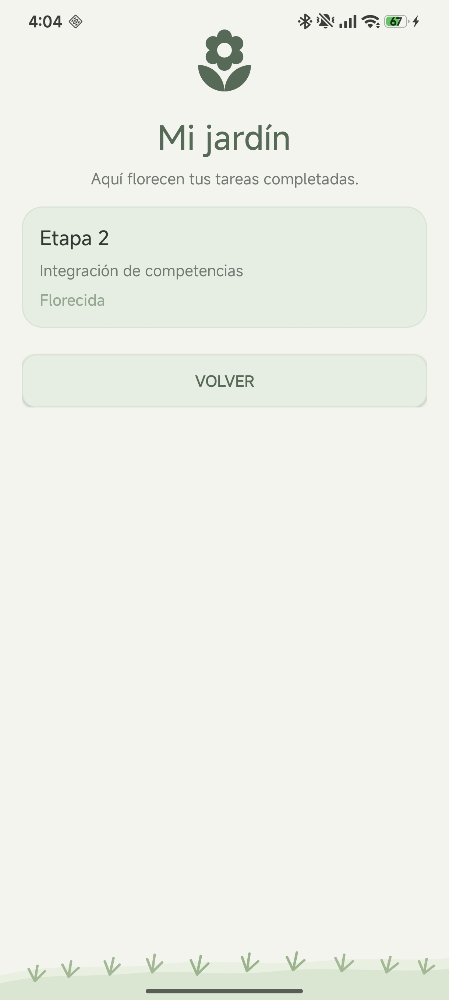

# 🌸 Bloomora

**Bloomora** es una aplicación Android desarrollada en **Java** cuyo objetivo es acompañar sesiones de estudio y concentración de una forma simple, amable y visual.

La aplicación representa las tareas como semillas que evolucionan según el progreso del usuario:

**🌱 Semilla → 🌿 Creciendo → 🌸 Florecida**

Una tarea nueva comienza como **Semilla**, pasa a **Creciendo** cuando se inicia una sesión de enfoque y se transforma en **Florecida** al completar el temporizador. Las tareas finalizadas pasan automáticamente a **Mi jardín**.

---

## 🌿 Objetivo

Bloomora busca ofrecer una experiencia de enfoque tranquila y fácil de entender, permitiendo:

- Crear y seleccionar tareas.
- Preparar una sesión de estudio mediante herramientas externas.
- Ejecutar un temporizador en segundo plano.
- Personalizar el nombre del usuario y la duración de las sesiones.
- Registrar tareas completadas en un jardín.
- Programar y consultar sesiones mediante el calendario del dispositivo.

---

## 📱 Navegación principal

La pantalla de inicio funciona como un menú simple de navegación y mantiene separada la información específica de las sesiones de estudio.



### Flujo de una tarea



---

## 🏠 Pantalla de inicio

La pantalla principal prioriza una navegación clara y conserva la identidad visual de Bloomora.

Incluye:

- Saludo personalizado.
- Acceso mediante ✏️ a la personalización.
- Mensaje motivacional.
- Botón principal **ENFOCARME**.
- Acceso a **Mis tareas**.
- Acceso a **Mi jardín**.
- Acceso a **Agenda**.

La información de la tarea activa, el temporizador y la preparación de la sesión se encuentran dentro de **Enfocarme**, evitando sobrecargar el menú principal.

---

## ✏️ Personalización

Desde **Haz Bloomora tuya** se puede configurar:

- Nombre o apodo.
- Duración predeterminada de la sesión.

Duraciones disponibles:

- 15 segundos (**DEMO**).
- 15 minutos.
- 25 minutos.
- 45 minutos.
- 60 minutos.

La configuración se conserva mediante `SharedPreferences`.

---

## 🌱 Gestión de tareas

En **Mis tareas** se pueden crear y seleccionar tareas para una próxima sesión.

Cada tarea almacena:

- Asignatura.
- Nombre de la tarea.
- Estado.

Los estados utilizados son:

- **Semilla**: tarea creada.
- **Creciendo**: sesión iniciada.
- **Florecida**: sesión terminada correctamente.

Las tareas se almacenan localmente utilizando `SharedPreferences` y una estructura JSON administrada por `GestorTareas`.

---

# 🔗 Intents implementados

Bloomora implementa **5 Intents implícitos y 3 Intents explícitos** como parte de su navegación e integración con Android.

## 🟠 5 Intents implícitos

Los Intents implícitos se encuentran principalmente en la sección **Prepara tu sesión**.

### 1. 📍 Lugar de estudio — Google Maps

Abre una aplicación de mapas y busca lugares adecuados para estudiar.

**Acción:** `Intent.ACTION_VIEW`  
**URI:** `geo:`

**Prueba:**

1. Entrar en **Enfocarme**.
2. Presionar **LUGAR DE ESTUDIO**.
3. Seleccionar una aplicación de mapas.
4. Verificar que aparezcan lugares relacionados con estudio o bibliotecas.

---

### 2. 🌐 Material — Navegador web

Abre material de apoyo mediante una página web.

**Acción:** `Intent.ACTION_VIEW`  
**URI:** `https://`

**Prueba:**

1. Entrar en **Enfocarme**.
2. Presionar **MATERIAL**.
3. Verificar que Android abra un navegador disponible.

---

### 3. 📷 Evidencia — Cámara

Permite capturar una fotografía como evidencia de la sesión de estudio.

**Acción:** `MediaStore.ACTION_IMAGE_CAPTURE`

Incluye:

- Solicitud del permiso `CAMERA`.
- Creación de una URI mediante `MediaStore`.
- Almacenamiento de la fotografía en la galería.
- Validación del resultado de la cámara.

**Prueba:**

1. Entrar en **Enfocarme**.
2. Presionar **EVIDENCIA**.
3. Autorizar el acceso a la cámara si Android lo solicita.
4. Capturar una fotografía.
5. Comprobar que la evidencia quede almacenada.

---

### 4. 🟦 Bluetooth — Configuración del dispositivo

Abre directamente la configuración de Bluetooth.

**Acción:** `Settings.ACTION_BLUETOOTH_SETTINGS`

**Prueba:**

1. Entrar en **Enfocarme**.
2. Presionar **BLUETOOTH**.
3. Verificar que Android abra la configuración de Bluetooth.

---

### 5. 📅 Agendar enfoque — Calendario

Permite crear una sesión futura utilizando la aplicación de calendario instalada.

**Acción:** `Intent.ACTION_INSERT`  
**URI:** `CalendarContract.Events.CONTENT_URI`

El evento incluye título, descripción y horario sugerido.

**Prueba:**

1. Entrar en **Enfocarme**.
2. Presionar **AGENDAR ENFOQUE**.
3. Verificar que se abra el formulario de creación de un evento.
4. Comprobar los datos precargados.

> La opción **Agenda** del menú principal utiliza además un `ACTION_VIEW` para consultar el calendario del dispositivo. Esta navegación es complementaria y no reemplaza ninguno de los cinco Intents implícitos evaluados.

---

## 🔵 3 Intents explícitos

### 1. Detalle de la tarea

Desde `SesionEnfoqueActivity` se abre `DetalleTareaActivity`.

Se envían datos dinámicos mediante `putExtra()`:

- Asignatura.
- Tarea.
- Estado.

`DetalleTareaActivity` valida que los datos recibidos no sean nulos antes de mostrarlos.

**Prueba:**

1. Crear una tarea.
2. Seleccionarla en **Mis tareas**.
3. Entrar en **Enfocarme**.
4. Presionar **VER DETALLE**.
5. Verificar asignatura, tarea y estado.

---

### 2. Servicio interno para el temporizador

`TemporizadorService` mantiene activa la sesión de enfoque en segundo plano.

Características:

- `Foreground Service`.
- `Thread` para controlar el tiempo.
- Notificación persistente durante la sesión.
- Permiso de notificaciones cuando corresponde.
- Posibilidad de detener la sesión.

Esto permite salir de la Activity sin perder el temporizador.

---

### 3. Broadcast interno

`TemporizadorService` comunica internamente los cambios del temporizador a `SesionEnfoqueActivity`.

Se utilizan Broadcasts para:

- Actualizar el tiempo restante.
- Informar que la sesión terminó.
- Cambiar la tarea activa a **Florecida**.
- Actualizar la interfaz.

---

## ⏱️ Sesión de enfoque

El flujo visual de esta pantalla sigue el orden natural de uso:

1. Revisar la tarea seleccionada.
2. Consultar su detalle.
3. Preparar la sesión mediante los Intents implícitos.
4. Iniciar el temporizador.
5. Mantener la sesión en segundo plano.
6. Completar la tarea.
7. Visualizarla posteriormente en **Mi jardín**.

Si no existe una tarea activa, Bloomora informa:

> **Sin tarea activa**  
> Selecciona una tarea en Mis tareas.

---

## 🌸 Mi jardín

**Mi jardín** muestra solamente las tareas cuyo estado sea **Florecida**.

Una tarea llega al jardín únicamente después de completar correctamente una sesión de enfoque.

Esto permite representar visualmente el progreso del usuario sin eliminar el historial de tareas terminadas.

---

# 🛡️ Validaciones implementadas

Bloomora incluye validaciones para reducir errores y evitar cierres inesperados:

- Nombre o apodo obligatorio al guardar la personalización.
- Asignatura obligatoria.
- Nombre de tarea obligatorio.
- Validación de existencia de tarea activa.
- Validación de datos recibidos por `Intent`.
- Control de permisos de cámara.
- Control de permiso de notificaciones.
- Validación de URI antes de abrir la cámara.
- Manejo de cancelación de fotografía.
- Manejo de `ActivityNotFoundException`.
- Confirmación antes de detener una sesión activa.
- Validación del índice de la tarea activa.

---

# 🧵 Threads y ejecución en segundo plano

El temporizador utiliza un `Thread` dentro de `TemporizadorService`.

El servicio:

1. Recibe la duración seleccionada.
2. Ejecuta el conteo regresivo en segundo plano.
3. Actualiza una notificación.
4. Envía Broadcasts a la Activity.
5. Mantiene el temporizador aunque el usuario salga de la pantalla.
6. Finaliza la tarea cuando el tiempo llega a cero.

---

# 💾 Persistencia de datos

Bloomora utiliza `SharedPreferences` para conservar información local.

### Preferencias del usuario

Archivo:

```text
preferenciasBloomora
```

Datos principales:

```text
nombreUsuario
duracionSegundos
```

### Tareas

`GestorTareas` almacena las tareas en formato JSON y mantiene el índice de la tarea activa.

Esto permite conservar el estado de la aplicación entre ejecuciones.

---

# 📸 Capturas de la aplicación

A continuación se presentan algunas de las principales vistas de Bloomora.

<p align="center">
  
  
  
</p>

<p align="center">
  <b>Inicio · Personalización · Mis tareas</b>
</p>

<p align="center">
  
  
  
</p>

<p align="center">
  <b>Sesión de enfoque · Detalle de tarea · Mi jardín</b>
</p>

---

# ⚙️ Configuración técnica

| Elemento | Configuración |
|---|---|
| Lenguaje | Java |
| IDE | Android Studio |
| Java | 11 |
| minSdk | 31 |
| targetSdk | 36 |
| compileSdk | 36 + minor API 1 |
| Android Gradle Plugin | 9.0.1 |
| Versión de Bloomora | 1.0 |

---

# 📦 APK

La aplicación fue compilada en formato APK de depuración.

- **Archivo:** `Bloomora-debug.apk`
- **Versión:** 1.0
- **Tipo:** Debug APK

La APK se encuentra disponible en la sección **Releases** del repositorio.

---

## 🌿 Git y organización del proyecto

- **Rama principal:** `main`
- **Rama de desarrollo:** `feature/intents`

Durante el desarrollo se utilizaron commits descriptivos para agrupar cambios funcionales relacionados.

Las funcionalidades fueron desarrolladas y probadas en `feature/intents`, y la versión final fue integrada a `main` mediante Pull Request.

---

# 📂 Estructura principal

```text
Bloomora/
├── app/
│   └── src/
│       └── main/
│           ├── java/com/devst/bloomora/
│           │   ├── MainActivity.java
│           │   ├── PersonalizacionActivity.java
│           │   ├── PorHacerActivity.java
│           │   ├── SesionEnfoqueActivity.java
│           │   ├── DetalleTareaActivity.java
│           │   ├── MiJardinActivity.java
│           │   ├── TemporizadorService.java
│           │   ├── GestorTareas.java
│           │   └── Tarea.java
│           ├── res/
│           └── AndroidManifest.xml
├── capturas/
├── README.md
└── ...
```

---

# 🧪 Flujo de prueba recomendado

Para revisar rápidamente el funcionamiento completo:

1. Abrir Bloomora.
2. Entrar en ✏️ **Personalizar Bloomora**.
3. Guardar nombre y seleccionar **15 segundos (DEMO)**.
4. Entrar en **Mis tareas**.
5. Crear una tarea.
6. Seleccionarla mediante **USAR PARA ENFOCARME**.
7. Entrar en **Enfocarme**.
8. Probar **Lugar de estudio**, **Material**, **Evidencia**, **Bluetooth** y **Agendar enfoque**.
9. Abrir **VER DETALLE** y comprobar los datos recibidos.
10. Presionar **INICIAR SESIÓN**.
11. Salir de la Activity y comprobar que el temporizador continúa mediante la notificación.
12. Volver a Bloomora.
13. Esperar que el temporizador llegue a `00:00`.
14. Comprobar el mensaje de sesión completada.
15. Entrar en **Mi jardín**.
16. Comprobar que la tarea aparezca como **Florecida**.
17. Abrir **Agenda** desde el menú principal y comprobar el calendario.

---

# 🌱 Aprendizajes y mejoras futuras

Durante el desarrollo se trabajó con:

- Intents explícitos e implícitos.
- Navegación entre Activities.
- Envío de datos con `putExtra()`.
- Permisos en tiempo de ejecución.
- `SharedPreferences`.
- JSON.
- `Foreground Service`.
- `Thread`.
- Broadcast interno.
- Notificaciones.
- Cámara y `MediaStore`.
- Integración con aplicaciones externas.
- Validaciones.
- Diseño y mejora de experiencia de usuario.

Como mejoras futuras podrían incorporarse edición y eliminación de tareas, estadísticas de sesiones, historial detallado, mayor personalización visual y recordatorios propios de Bloomora.

---

## 🌸 Bloomora

**Cultiva tu concentración.**
